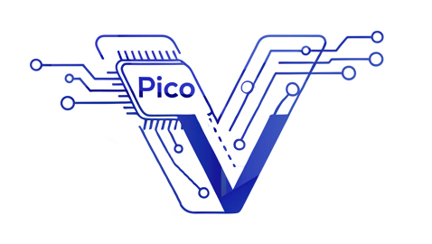

# Pico-V: A Tiny RV32IMF RISC-V MCU Design

## Overview

Welcome to the **Pico-V** project\! This repository contains the **(RTL) design** for **Pico-V**, a compact and versatile Microcontroller Unit (MCU) based on the **RV32IMF RISC-V** architecture.

Pico-V is more than just an MCU for users; it's a meticulously designed hardware core, accompanied by a robust Vivado-based simulation environment and a comprehensive suite of test cases. Our goal is to provide a fully verifiable and synthesizable RISC-V core with essential peripherals, ideal for integration into larger SoC designs or for FPGA-based embedded development.

## Key Features

The Pico-V RTL design incorporates a robust set of features:

  * **RV32IMF RISC-V Core:** A 32-bit RISC-V processor with Integer (I), Multiply/Divide (M), and Single-Precision Floating-Point Unit (F) extensions. This powerful core is designed for efficient execution of complex arithmetic operations.
  * **Integrated Peripherals:**
      * **Analog-to-Digital Converter (ADC) Interface:** RTL for interfacing with an external or simulated ADC.
      * **Digital-to-Analog Converter (DAC) Interface:** RTL for controlling an external or simulated DAC.
      * **Universal Asynchronous Receiver-Transmitter (UART):** Configurable serial communication interface.
      * **General Purpose Input/Output (GPIO):** Flexible digital pins for controlling and reading external components.
  * **Synthesizable RTL:** Designed with synthesizability in mind, enabling deployment on FPGAs or ASIC fabrication.
  * **Vivado Simulation Environment:** A complete setup for simulating the Pico-V core and its peripherals within Xilinx Vivado.
  * **Comprehensive Test Cases:** A suite of test cases to verify the functionality and correctness of the RISC-V core and its peripherals.

## License

This project is licensed under the MIT License. See the `LICENSE` file for more details.

## Support

For any questions, issues, or discussions, please open an issue on this GitHub repository.

**Embark on your RISC-V hardware design journey with Pico-V\!**

